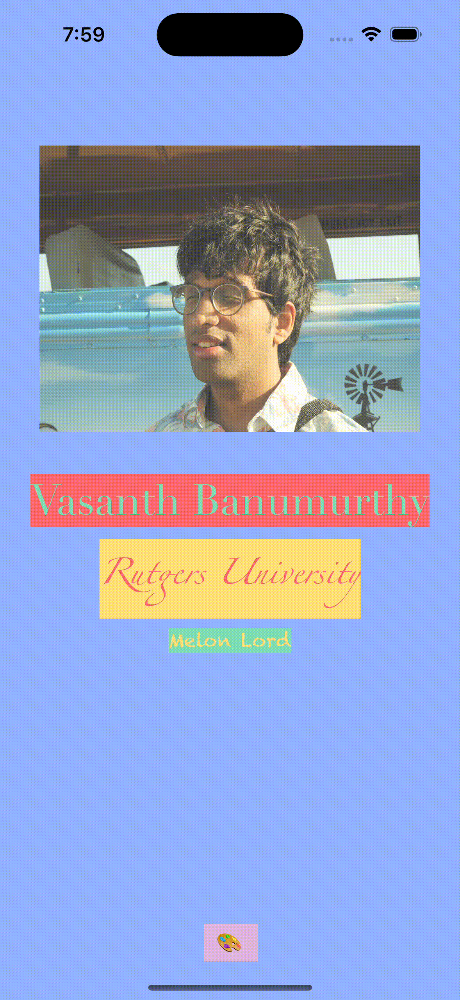

# CodePath iOS 101 Pre-work
# Prework - *myID*

Submitted by: **Vasanth Banumurthy**

**myID** is an app that lets you customize a virtual ID Card!

Time spent: **1** hours spent in total

## Required Features

The following **required** functionality is completed:

- [x] Users are see a screen with three labels and a button
- [x] Tapping the button changes the screen color to a random color
 
## Video Walkthrough

  

<!-- Replace this with whatever GIF tool you used! -->
GIF created with [LICEcap](https://www.cockos.com/licecap/)
<!-- Recommended tools:
[Kap](https://getkap.co/) for macOS
[ScreenToGif](https://www.screentogif.com/) for Windows
[peek](https://github.com/phw/peek) for Linux. -->

## App Brainstorming (Step 4)

Spotify
- Personalized recommendations
- Make Playlists
- Add friends

YouTube
- Endless recommendations
- Picture in picture
- Custom Resolution

Telegram
- Fast, Fast, Fast
- Saved Messages
- Multiplatform

A cool idea would be an app inspired by my take on the prework. Users would be able to create a custom ID card that they can share with others. They can add stuff such as links to Social Media, Contact Info, or even what music they are currently listening to. A unique way to do this would be to compile QR codes since many apps have them nowadays.

## Notes

Had Fun

## License

    Copyright [2023] [Vasanth Banumurthy]

    Licensed under the Apache License, Version 2.0 (the "License");
    you may not use this file except in compliance with the License.
    You may obtain a copy of the License at

        http://www.apache.org/licenses/LICENSE-2.0

    Unless required by applicable law or agreed to in writing, software
    distributed under the License is distributed on an "AS IS" BASIS,
    WITHOUT WARRANTIES OR CONDITIONS OF ANY KIND, either express or implied.
    See the License for the specific language governing permissions and
    limitations under the License.
